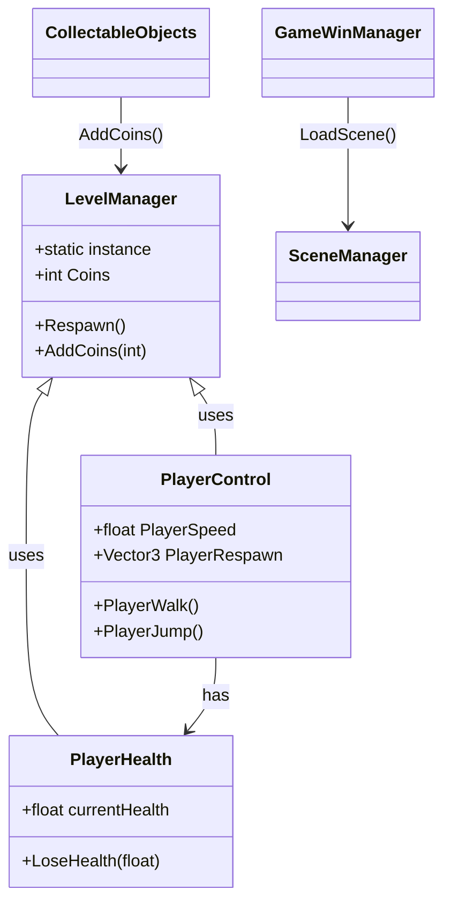

# Class Diagram & Key Code Excerpts

Below is a simple class diagram (Mermaid) showing the main gameplay classes and their relations, followed by 3–5 important code snippets with short explanations.



## Key code excerpts and explanations

1) `LevelManager` (Singleton pattern)

```csharp
public class LevelManager : MonoBehaviour
{
    public static LevelManager instance;
    void Awake() {
        if (instance == null) { instance = this; DontDestroyOnLoad(gameObject); }
        else { Destroy(gameObject); }
    }
    // ... other methods (Respawn, AddCoins)
}
```

Explanation: `LevelManager` is made a singleton so its state (score, checkpoint references) is globally accessible via `LevelManager.instance` without expensive lookups. `DontDestroyOnLoad` keeps it across scenes.

2) `PlayerControl.PlayerWalk()` (movement + facing)

```csharp
public void PlayerWalk()
{
    PlayerMovement = Input.GetAxis("Horizontal");
    PlayerRigid.velocity = new Vector2(PlayerMovement * PlayerSpeed, PlayerRigid.velocity.y);
    if (PlayerMovement > 0) transform.localScale = new Vector2(1f,1f);
    else if (PlayerMovement < 0) transform.localScale = new Vector2(-1f,1f);
}
```

Explanation: Uses `Rigidbody2D.velocity` for responsive movement and flips `localScale.x` to mirror sprite for facing direction.

3) `PlayerHealth.LoseHealth(float)` (damage and death handling)

```csharp
public async Task LoseHealth(float Damage)
{
    currentHealth = Mathf.Clamp(currentHealth - Damage, 0, startHealth);
    if (currentHealth > 0) Animation.SetTrigger("Hurt");
    else {
        if (!dead) {
            Animation.SetTrigger("Die");
            dead = true;
            await Task.Delay(2000);
            GameLevelManager.Respawn();
            currentHealth = startHealth; dead = false;
        }
    }
}
```

Explanation: This handles damage, plays animations, and when health reaches zero it triggers death flow and respawn after a delay (or loads a Game Over scene depending on level).

4) `CollectableObjects.OnTriggerEnter2D` (score collection)

```csharp
void OnTriggerEnter2D(Collider2D other)
{
    if (other.CompareTag("Player")) {
        GameLevelManager.AddCoins(coinValue);
        Destroy(gameObject);
    }
}
```

Explanation: Simple pickup behaviour — when colliding with player, the object adds coins via `LevelManager` and destroys itself.

---

If you want, I can convert this into an image class diagram (PNG) or expand explanations into 3–5 longer code excerpts for the report.
