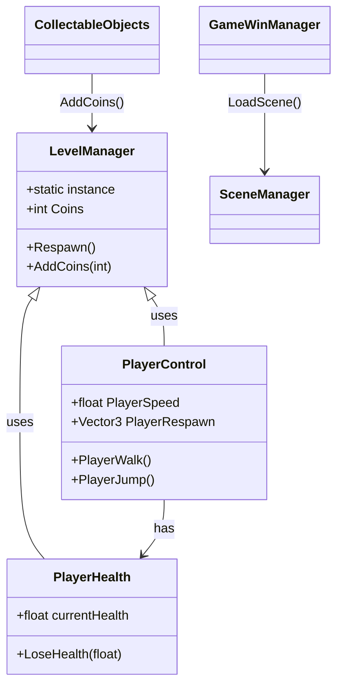

Chuyển sơ đồ Mermaid thành ảnh PNG để dễ chèn vào báo cáo (CLASS_DIAGRAM.md → PNG).# Sơ đồ lớp & Các đoạn mã quan trọng

Dưới đây là sơ đồ lớp đơn giản (Mermaid) thể hiện các lớp chính trong gameplay và mối quan hệ giữa chúng, kèm theo 3–5 đoạn mã quan trọng với phần giải thích ngắn.



## Các đoạn mã tiêu biểu và giải thích

1.  `LevelManager` (mẫu Singleton)

```csharp
public class LevelManager : MonoBehaviour
{
    public static LevelManager instance;
    void Awake() {
        if (instance == null) { instance = this; DontDestroyOnLoad(gameObject); }
        else { Destroy(gameObject); }
    }
    // ... các phương thức khác (Respawn, AddCoins)
}
```

Giải thích: `LevelManager` được làm thành singleton để trạng thái toàn cục (điểm, vị trí checkpoint...) có thể truy cập dễ dàng thông qua `LevelManager.instance` mà không phải tốn chi phí tìm kiếm. `DontDestroyOnLoad` giữ đối tượng không bị hủy khi chuyển scene.

2.  `PlayerControl.PlayerWalk()` (di chuyển và xoay hướng)

```csharp
public void PlayerWalk()
{
    PlayerMovement = Input.GetAxis("Horizontal");
    PlayerRigid.velocity = new Vector2(PlayerMovement * PlayerSpeed, PlayerRigid.velocity.y);
    if (PlayerMovement > 0) transform.localScale = new Vector2(1f,1f);
    else if (PlayerMovement < 0) transform.localScale = new Vector2(-1f,1f);
}
```

Giải thích: Sử dụng `Rigidbody2D.velocity` để di chuyển nhạy, đồng thời đảo `localScale.x` để lật sprite theo hướng đi.

3.  `PlayerHealth.LoseHealth(float)` (xử lý sát thương & chết)

```csharp
public async Task LoseHealth(float Damage)
{
    currentHealth = Mathf.Clamp(currentHealth - Damage, 0, startHealth);
    if (currentHealth > 0) Animation.SetTrigger("Hurt");
    else {
        if (!dead) {
            Animation.SetTrigger("Die");
            dead = true;
            await Task.Delay(2000);
            GameLevelManager.Respawn();
            currentHealth = startHealth; dead = false;
        }
    }
}
```

Giải thích: Đoạn mã xử lý mất máu, phát animation hurt hoặc die. Khi về 0 máu sẽ thực hiện luồng chết và hồi sinh sau độ trễ, hoặc load scene Game Over tùy level.

4.  `CollectableObjects.OnTriggerEnter2D` (thu thập điểm)

```csharp
void OnTriggerEnter2D(Collider2D other)
{
    if (other.CompareTag("Player")) {
        GameLevelManager.AddCoins(coinValue);
        Destroy(gameObject);
    }
}
```

Giải thích: Khi va chạm với Player, vật phẩm gọi `AddCoins` của `LevelManager` rồi tự hủy.

---

Nếu bạn muốn, mình có thể chuyển sơ đồ mermaid thành ảnh PNG để chèn vào báo cáo hoặc mở rộng phần giải thích thành các đoạn phân tích dài hơn cho báo cáo.
