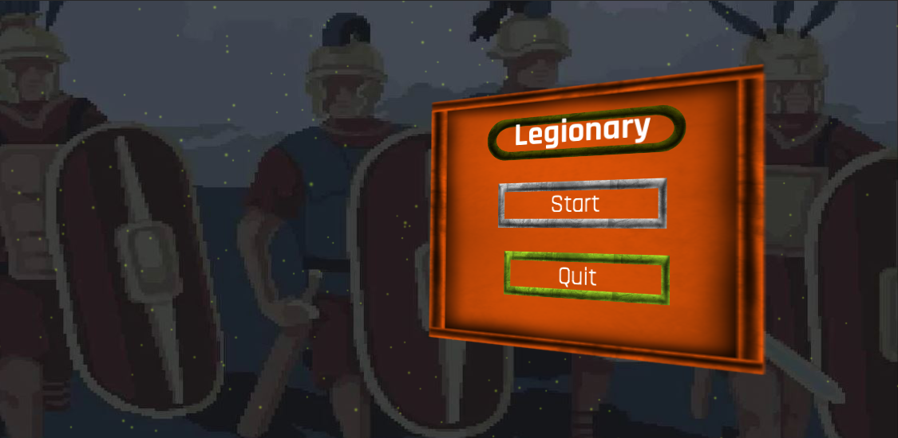
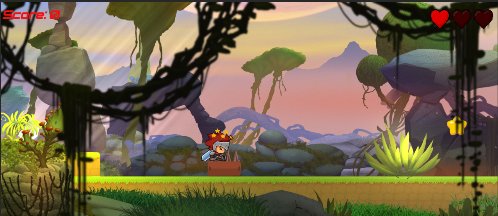
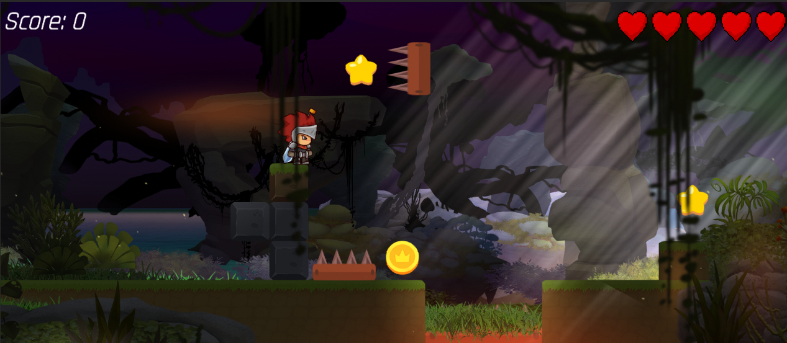
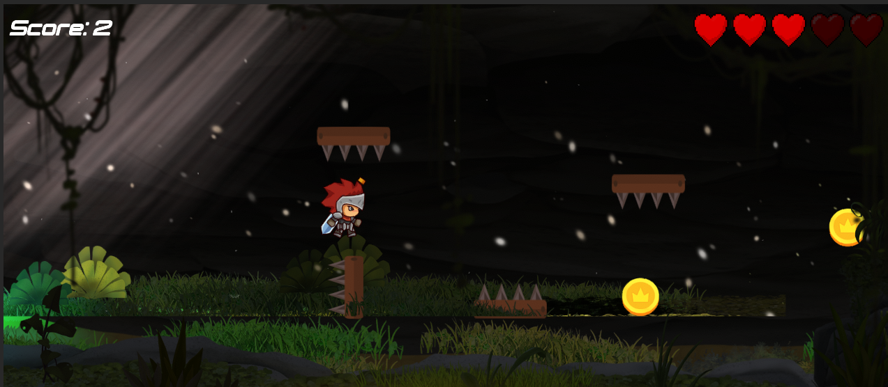
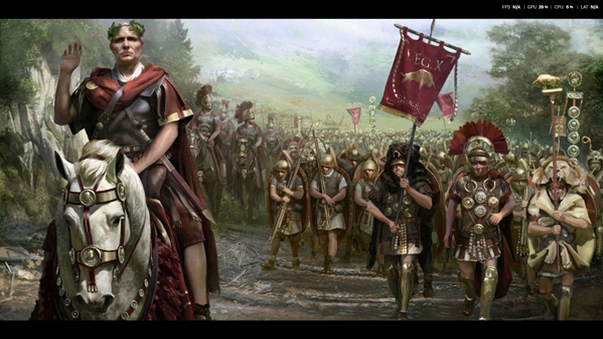
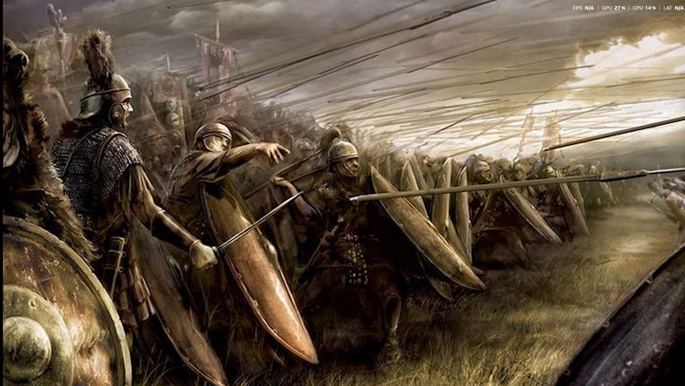

# Legionary ⚔️ - 2D Platformer Game

Chào mừng bạn đến với **Legionary**, một tựa game hành động đi cảnh 2D (2D Platformer) được phát triển hoàn toàn trên nền tảng **Unity Engine** và ngôn ngữ lập trình **C#**.

---

## 👨‍💻 Thông tin Sinh viên & Cam kết

- **Sinh viên thực hiện:** Phùng Võ Quốc Hiển (Lacia)
- **Mã số sinh viên:** 2212364
- **Môn học:** Đồ án / Bài tập lớn cuối kỳ
- **Cam kết bản quyền:** Em xin cam đoan đây là dự án game do chính em tùy chỉnh và hoàn thiện. Các dòng code logic lõi, cấu trúc kiến trúc (Design Pattern), và việc tích hợp các tài nguyên vào trò chơi đều do em tự nghiên cứu, làm gọn, tối ưu và thực hiện theo đúng yêu cầu đề bài của giảng viên.

---

## 📖 Giới thiệu Trò chơi (Gameplay)

Trong **Legionary**, người chơi sẽ hóa thân thành một chiến binh dũng cảm vượt qua các chướng ngại vật, vực thẳm và kẻ thù nguy hiểm. Mục tiêu là thu thập tiền xu (coins), duy trì thanh sinh lực (HP), đi qua các trạm kiểm soát (checkpoints) và sống sót tiến tới đích để giành chiến thắng.

### Cốt lõi của Game (Core Mechanics):

- **Di chuyển & Nhảy:** Chuyển động vật lý mượt mà sử dụng hệ thống Rigidbody2D.
- **Va chạm (Collision & Triggers):** Tương tác với môi trường, ăn điểm, mất máu khi chạm quái vật hoặc bẫy.
- **Hệ thống Sinh lực (Health System):** Người chơi có số lượng máu nhất định, sẽ Game Over nếu máu về 0 hoặc rơi xuống vực.
- **Hệ thống Điểm (Score System):** Ăn tiền xu trên đường đi để gia tăng điểm số.

---

## 🌟 Tính năng Kỹ thuật Chi tiết

Dự án này đã áp dụng đầy đủ quy trình và các kiến thức trọng tâm của một sản phẩm game 2D:

1. **Hệ thống Quản lý Màn chơi (Level & Scene Management):**
   - Game bao gồm **3 Level trọng tâm** với độ khó tăng dần và các hazard (chướng ngại) khác nhau.
   - Luồng chuyển cảnh hoàn chỉnh: **Main Menu** (Màn hình chính) ➔ **Intro Video** (Video cốt truyện) ➔ **Level 1, 2, 3** ➔ **Game Over** (nếu thua) hoặc **Win Screen** (nếu thắng).

2. **Áp dụng Mẫu thiết kế phần mềm (Design Patterns):**
   - **Singleton Pattern:** Được áp dụng thành công trong lớp LevelManager để tạo ra một thể hiện duy nhất quản lý toàn cục các hệ thống như Điểm số (Score), Trạng thái màn chơi, Checkpoint mà không bị hủy khi chuyển phân cảnh (DontDestroyOnLoad). Việc áp dụng pattern giúp làm sạch mã nguồn, dễ dàng truy xuất LevelManager.instance từ bất kỳ file script nào thay vì hàm FindFirstObjectByType cực kỳ hao tốn tài nguyên.

3. **Giao diện Người dùng (UI HUD):**
   - Quản lý giao diện Text và Slider hiển thị trực quan Thanh Máu (Health Bar) và Số Điểm.
   - Canvas linh hoạt, cho phép scale tốt trên nhiều độ phân giải màn hình.

4. **Hệ thống Hồi sinh (Checkpoint & Respawn):**
   - Lưu trữ vị trí an toàn cho người chơi. Tích hợp Coroutine tạo độ trễ (delay) một khoảng giây trước khi hồi sinh nhân vật, mang lại cảm giác thiết kế mượt mà hơn.

5. **Hoạt họa, Âm thanh & Multi-Media:**
   - Cây Animator Controller được thiết lập cho nhân vật (Idle, Run, Jump).
   - Tích hợp VideoPlayer component - bắt sự kiện video kết thúc (loopPointReached) để tự động chuyển scene chơi game.

---

## 🎮 Hướng dẫn Cài đặt & Cách chơi

### 1. Yêu cầu Hệ thống môi trường

- **Công cụ:** Unity Editor phiên bản 2023.1.9f1 (Hoặc các bản 2023 2024 mới nhất).
- **Hệ điều hành:** Windows 10/11 hoặc macOS.
- **Phần cứng:** RAM tối thiểu 4GB, CPU từ 2 nhân trở lên.

### 2. Cách mở Dự án & Build Game

1. Mở **Unity Hub**.
2. Chọn mục Open -> Trỏ đường dẫn đến thư mục Unity-2D-Platformer-master.
3. Sau khi editor load xong thư viện, mở thư mục Assets/All scenes và click đúp để mở scene Main Menu.unity.
4. Nhấn nút **Play** (▶) ở phía trên cùng của Unity Editor để bắt đầu trải nghiệm.

### 3. Phím điều khiển (Controls)

- **A / D** hoặc **Mũi tên Trái / Phải:** Di chuyển nhân vật sang hai bên.
- **Space** hoặc **W / Mũi tên Lên:** Nhảy qua chướng ngại vật/ vực thẳm.
- **Chuột (Mouse):** Tương tác với các nút bấm giao diện trên Menu UI (Start, Continue, Quit, Skip...).

---

## 📸 Hình ảnh Minh họa (Screenshots)

**1. Màn hình Chính (Main Menu)**

**2. Môi trường & Thử thách Màn 1**

**3. Môi trường & Thử thách Màn 2**

**4. Khung cảnh thiết kế Tilemap 2D chung**

**5. Screenshot bổ sung A**

**6. Screenshot bổ sung B**

---

_Chân thành cảm ơn Thầy Nguyễn Trọng Hiếu đã hướng dẫn bộ môn và dành thời gian xem xét, đánh giá đồ án này. Dự án "Legionary" là thành quả đúc kết, áp dụng thực hành Unity vững vàng của sinh viên sau học kỳ đầy bổ ích._

## 📄 Báo cáo chính thức

- Báo cáo hoàn chỉnh: [REPORT_FINAL.md](REPORT_FINAL.md)

_Chân thành cảm ơn Thầy Nguyễn Trọng Hiếu đã hướng dẫn bộ môn và dành thời gian xem xét, đánh giá đồ án này. Dự án "Legionary" là thành quả đúc kết, áp dụng thực hành Unity vững vàng của sinh viên sau học kỳ đầy bổ ích._
